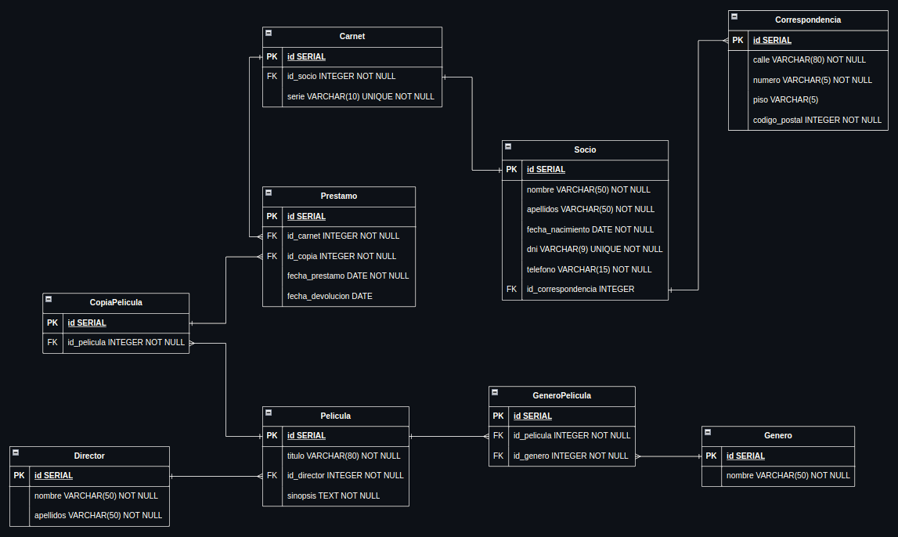

# Videoclub Data Base
Práctica de KeepCoding para emplear los conceptos de **SQL** aprendidos en el módulo de Modelado de Datos e Introducción a SQL.

## Tabla de contenidos

- [Descripción](#descripción)
- [Uso](#uso)
- [Capturas](#capturas)
- [Autor](#autor)

## Descripción
Este proyecto consiste en un diagrama entidad / relación para una base de datos de un videoclub y un script en **PostgreSQL** para traducir dicho diagrama, insertar y consultar datos.

Cada tabla consta de sus propios registros.

## Uso
Copia el contenido de `videoclub_script.sql` en tu editor de bases de datos y ejecuta el script.

El editor empleado para la edición y visualización del script ha sido DBeaver Community.

## Capturas

## Autor
Miguel Fernández @miguelferlez